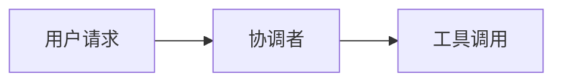

# Agentdown

`Agentdown` 是一个面向 Vue 3 的 agent-native markdown UI runtime，目标是把 `markdown-it` 的结构化解析能力、`@chenglou/pretext` 的高性能文本布局能力，以及 AGUI 组件注入组合起来，服务 AI 长文本、流式输出、工具调用和多 agent 协作场景。

`0.0.1` 是一个适合公开测试的首发版本：核心渲染链路、AGUI runtime、类型声明、npm 打包和 demo 已经打通，但协议层和测试体系仍然会继续迭代。

## 0.0.1 测试版包含什么

- `Vue 3 + Vite + TypeScript` 的 npm 库工程
- `MarkdownRenderer` 组件
- `@chenglou/pretext` 纯文本段落/标题布局
- `markdown-it` 解析链路
- `:::thought` 折叠块
- `:::vue-component ComponentName {...}` AGUI 组件注入
- 响应式 AGUI runtime 与事件流
- 内置 `text / code / mermaid / thought / math / html / agui` 组件可覆写
- 表格、图片、链接、引用、列表等复杂 markdown 增强渲染
- 图片预览、Mermaid 全屏预览、拖拽和平滑滚轮缩放
- 官方核心 agent 事件 helpers
- 自定义 AGUI reducer
- `highlight.js` 代码高亮
- `KaTeX` 块级公式渲染
- 尽量中性的默认样式，方便接入自己的 Design System
- 本地 demo 页面

## 安装

```bash
npm install @codexiaoke/agentdown
```

```ts
import { MarkdownRenderer } from '@codexiaoke/agentdown';
import '@codexiaoke/agentdown/style.css';
import 'katex/dist/katex.min.css';
```

## 使用

```vue
<script setup lang="ts">
import { MarkdownRenderer } from '@codexiaoke/agentdown';
import '@codexiaoke/agentdown/style.css';
import 'katex/dist/katex.min.css';

const source = `
# Hello

:::thought
这是可以折叠的思考过程。
:::

\`\`\`mermaid
flowchart LR
  A[User] --> B[Agent]
\`\`\`

:::vue-component ApprovalCard {"id": 1, "status": "pending"}
`;

const aguiComponents = {
  ApprovalCard: {
    component: ApprovalCard,
    minHeight: 96
  }
};

const builtinComponents = {
  code: MinimalCodeBlock,
  mermaid: MinimalMermaidBlock,
  thought: MinimalThoughtBlock
};
</script>

<template>
  <MarkdownRenderer
    :source="source"
    :agui-components="aguiComponents"
    :builtin-components="builtinComponents"
  />
</template>
```

## 替换内置组件

如果你想把默认代码块、思考块，或者 AGUI 外壳接入自己的 Design System，可以直接覆盖：

```ts
import {
  DefaultMarkdownCodeBlock,
  DefaultMarkdownMermaidBlock,
  MarkdownRenderer,
  type MarkdownBuiltinComponentOverrides
} from '@codexiaoke/agentdown';

const builtinComponents: MarkdownBuiltinComponentOverrides = {
  code: MyCodeBlock,
  mermaid: MyMermaidBlock,
  thought: MyThoughtBlock
};
```

可覆写的 key：

- `text`
- `code`
- `mermaid`
- `thought`
- `math`
- `html`
- `agui`

如果你只是想在默认实现上包一层，也可以直接复用导出的 `DefaultMarkdownCodeBlock`、`DefaultMarkdownThoughtBlock` 等内置组件。

## AGUI 语法

```md
:::vue-component ApprovalCard {"id": 1, "status": "pending"}
```

也支持简单的 key-value 形式：

```md
:::vue-component ApprovalCard id=1 status="pending"
```

## Mermaid 语法

````md

````

## AGUI Runtime

```ts
import {
  agentBlocked,
  createAguiRuntime,
  useAguiEvents,
  useAguiState,
  type AgentNodeState
} from '@codexiaoke/agentdown';

const runtime = createAguiRuntime({
  reducer: ({ event, previousState }) => {
    if (event.type === 'agent.blocked') {
      return {
        patch: {
          kind: previousState?.kind ?? 'agent',
          status: 'waiting_tool',
          message: event.message ?? 'Waiting for downstream tool output.'
        }
      };
    }
  }
});

runtime.emit(agentBlocked({
  nodeId: 'node:agent-1',
  message: 'Waiting for pricing.lookup'
}));
```

在 AGUI 组件内部，推荐直接使用细粒度 hooks：

```ts
const state = useAguiState<AgentNodeState>();
const events = useAguiEvents();
```

说明：

- `runtime.emit(event)` 会先记录事件，再把事件归约成节点状态
- 推荐优先使用 `runStarted()`、`agentStarted()`、`toolStarted()` 这类官方 helpers 来构造事件
- 内置事件如 `run.started`、`agent.started`、`tool.finished` 会自动更新状态
- 自定义事件如 `agent.blocked` 可以通过 `reducer` 映射成你自己的状态语义
- 如果两个组件使用相同的 `ref`，它们会共享同一份 runtime binding

更多文档：

- [文档首页](./docs/index.md)
- [快速开始](./docs/guide/getting-started.md)
- [AGUI Runtime 协议](./docs/runtime/protocol.md)
- [发布清单](./docs/reference/release.md)
- [路线图](./docs/reference/roadmap.md)

## 设计约束

- 纯文本段落和标题优先走 `pretext`
- 含有复杂行内标记的块会先回退到 HTML 渲染
- 复杂块元素如列表、引用、表格、图片、链接会先走增强型 HTML 渲染
- ` ```mermaid ` fence 会直接渲染成 Mermaid 图表块
- AGUI 当前首版支持块级组件注入

## 当前已知缺口

- 还没有自动化测试与 CI 发布流程，当前主要依赖严格类型检查、构建和 pack 验证
- runtime 目前更偏向 `run / agent / tool` 生命周期展示，`artifact / approval / replay / timeline` 仍在补协议
- markdown 渲染优先解决 agent 展示场景，复杂 inline 协议和更细粒度 block schema 还会继续演进
- 默认 UI 是中性的基础实现，真实产品通常仍建议覆写 `code / thought / html / agui` 等内置组件

## 打包与发布

```bash
npm run typecheck
npm run build
npm run pack:check
npm publish
```

说明：

- 包内已经包含 `.d.ts` 声明文件
- `publishConfig.access=public` 已配置，首次发布 scoped 包时不需要额外补 `--access public`
- 当前 tarball 体积约 `32 kB`，`mermaid` 以运行时依赖方式提供，不再被整体打进库产物

## 开发

```bash
npm install
npm run dev
```

## 文档站

仓库已经内置了 `VitePress` 文档站和 GitHub Pages 自动部署工作流：

```bash
npm run docs:dev
npm run docs:build
npm run docs:preview
```

## 后续路线

1. 把 AGUI runtime 从 demo 能力收敛成稳定的公开 API，并补齐更多 reducer / node schema 示例。
2. 把更多 Markdown block 和 inline token 接入精细化布局树。
3. 增加流式输出优化、事件驱动状态流和多 agent 视图。
4. 补齐测试、文档站和 CI 发布流程。
