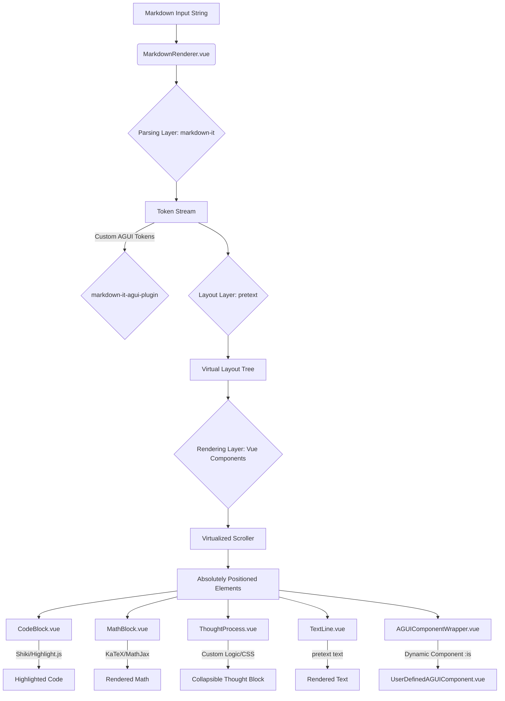
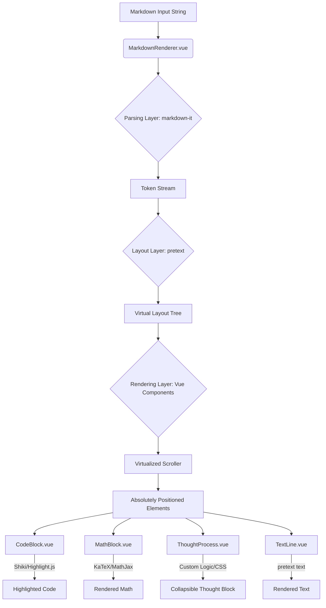

# Vue-Pretext-Markdown 开源项目设计方案

## 1. 项目愿景与目标

**项目名称**：`Vue-Pretext-Markdown`

**愿景**：创建一个基于 Vue 3 的高性能、高定制化 Markdown 渲染库，旨在解决传统 DOM 渲染在处理大模型长文本、流式输出时遇到的性能瓶颈，并提供媲美 DeepSeek 网页端的流畅体验和精美排版。

**目标**：
*   利用 `chenglou/pretext` 的非 DOM 文本测量与布局能力，实现极致流畅的文本渲染。
*   提供灵活的定制化能力，允许开发者轻松实现 DeepSeek 风格的代码高亮、数学公式、思考过程等。
*   兼容 Vue 3 的响应式系统，提供易于使用的组件 API。
*   作为一个开源项目，促进高性能文本渲染技术在 Vue 生态中的应用。

## 2. 核心技术栈

*   **Vue 3**：作为前端框架，提供组件化、响应式和高性能的视图层。
*   **`markdown-it`**：高性能 Markdown 解析器，将 Markdown 文本转换为抽象语法树（AST）或 Token 序列。
*   **`chenglou/pretext`**：核心文本测量与布局引擎，负责在不触发 DOM 回流的情况下，精确计算文本的尺寸和行布局。
*   **`Shiki` / `Highlight.js`**：用于代码块语法高亮。
*   **`KaTeX` / `MathJax`**：用于数学公式（LaTeX）渲染。
*   **原生 CSS + CSS 变量**：提供基础样式和丰富的 CSS 变量，便于用户进行深度定制和主题切换，同时保持零外部样式依赖。

## 3. 核心特性

*   **高性能渲染**：通过 `pretext` 避免 DOM 回流，尤其在长文本和流式输出场景下表现卓越。
*   **高度定制化**：支持自定义渲染规则、注入 Vue 组件，轻松实现个性化样式和交互。
*   **DeepSeek 风格支持**：
    *   **代码块**：支持语言标识、复制按钮、行号、高亮主题。
    *   **数学公式**：支持行内和块级 LaTeX 公式渲染。
    *   **思考过程**：实现可折叠/展开的“思考过程”区块，并支持自定义动画。
*   **流式输出优化**：针对 AI 聊天场景，优化文本逐字或逐行输出时的渲染性能和用户体验。
*   **跨平台潜力**：`pretext` 的非 DOM 特性为未来扩展到 Canvas、SVG 甚至 WebGL 渲染提供了可能。

## 4. 架构设计

`Vue-Pretext-Markdown` 的架构将分为以下几个主要层级：

### 4.1 解析层 (Parsing Layer)

*   **职责**：将原始 Markdown 字符串解析成结构化的数据。
*   **实现**：使用 `markdown-it`。它将 Markdown 文本转换为一系列 Token，这些 Token 包含了文本内容、类型（如标题、段落、代码块）、属性等信息。
*   **输出**：一个 Token 数组，代表了 Markdown 内容的结构。

### 4.2 布局层 (Layout Layer)

*   **职责**：根据解析层输出的 Token，结合容器宽度和字体样式，使用 `pretext` 计算每个文本片段的精确尺寸和行布局（如行高、行宽、换行点）。
*   **实现**：
    1.  遍历 `markdown-it` 生成的 Token 数组。
    2.  对于纯文本内容，将其传入 `pretext.prepare()` 进行预处理，获取不依赖 DOM 的文本测量数据。
    3.  根据实际渲染宽度，调用 `pretext.layoutWithLines()` 或 `pretext.layoutNextLine()` 计算出每一行的文本内容、宽度、高度等。
    4.  对于非文本内容（如图片、表格、自定义组件），需要预估或通过其他方式获取其尺寸。
*   **输出**：一个包含所有渲染元素（文本行、图片、代码块、公式等）及其精确位置和尺寸信息的“虚拟布局树”。

### 4.3 渲染层 (Rendering Layer)

*   **职责**：根据布局层生成的“虚拟布局树”，在 Vue 组件中高效地渲染出最终的视觉效果。
*   **实现**：
    1.  **主组件**：`MarkdownRenderer.vue`，接收 Markdown 字符串作为 Prop。
    2.  **虚拟化列表**：对于长文本，采用虚拟化列表（如 `vue-virtual-scroller` 或 `vue-recycle-scroller`）来只渲染视口内的元素，进一步提升性能。
    3.  **DOM 元素定位**：由于 `pretext` 提供了精确的布局信息，渲染层可以为每个文本行、代码块、图片等元素生成绝对定位的 `<div>` 或 `<span>`，并设置其 `top`, `left`, `width`, `height` 样式。
    4.  **内容渲染**：
        *   **纯文本**：直接渲染 `pretext` 返回的文本行。
        *   **代码块**：使用 `Shiki` 或 `Highlight.js` 进行语法高亮，并包裹在 `<pre><code>` 标签中。考虑使用 Vue 的 `teleport` 或 `v-html` 结合样式隔离。
        *   **数学公式**：使用 `KaTeX` 或 `MathJax` 渲染为 SVG 或 HTML 片段。
        *   **图片**：渲染为 `` 标签。
        *   **自定义组件**：提供插槽或配置项，允许用户为特定 Markdown 元素（如思考过程）注入自定义 Vue 组件。

### 4.4 组件结构示意



## 5. DeepSeek 风格特性实现细节

### 5.1 代码块

*   **解析**：`markdown-it` 会将代码块解析为 `fence` Token。
*   **高亮**：在渲染层，使用 `Shiki` (推荐，提供更准确的 VS Code 级别高亮) 或 `Highlight.js` 对代码内容进行高亮处理。
*   **UI**：创建一个 `CodeBlock.vue` 组件，接收高亮后的代码 HTML、语言类型和原始代码内容。该组件内部实现：
    *   顶部显示语言标识。
    *   右上角提供复制按钮。
    *   使用 `pretext` 测量代码行，确保行高和布局的精确性。
    *   通过 CSS 实现平滑滚动和主题切换。

### 5.2 思考过程 (Thought Process)

*   **解析**：这通常是一个非标准的 Markdown 扩展。可以通过 `markdown-it` 的插件机制实现自定义 Token，例如识别 `:::thought` 和 `:::` 标记。
    ```markdown
    :::thought
    这是我的思考过程。
    ::: 
    ```
*   **布局**：`pretext` 依然负责内部文本的布局。整个思考过程区块作为一个整体，其高度和位置由 `pretext` 辅助计算。
*   **UI**：创建一个 `ThoughtProcess.vue` 组件，接收思考内容。该组件内部实现：
    *   默认折叠，点击展开。
    *   使用 Vue 的 `transition` 组件实现平滑的展开/折叠动画。
    *   通过 CSS 设置柔和的背景色和边框，与普通文本区分开来。

### 5.3 数学公式

*   **解析**：使用 `markdown-it-mathjax` 或 `markdown-it-katex` 插件，将 `$` 或 `$$` 包裹的 LaTeX 表达式解析为特定的 Token。
*   **渲染**：在渲染层，创建一个 `MathBlock.vue` 组件，接收 LaTeX 表达式。组件内部使用 `KaTeX` 或 `MathJax` 库将其渲染为 HTML 或 SVG。
*   **布局**：`pretext` 不直接处理数学公式的内部布局，但会将其作为一个整体元素进行尺寸预估和定位。

### 5.4 AGUI 动态组件注入系统 (Agentic UI)

**愿景**：将 `Vue-Pretext-Markdown` 从一个纯粹的渲染器升级为一个**智能交互界面**，允许大型语言模型 (LLM) 通过特定的 Markdown 语法，动态地在渲染内容中注入用户自定义的 Vue 组件，实现审批按钮、实时数据表格、图表、表单等复杂交互。

**核心思想**：
*   **LLM 输出指令**：LLM 在生成 Markdown 内容时，可以嵌入特定的指令（例如自定义的 Markdown 语法或 HTML 注释），指示前端渲染器加载并渲染某个 Vue 组件，并传递相应的 Props。
*   **组件注册与映射**：用户可以在 `Vue-Pretext-Markdown` 实例中注册自定义的 Vue 组件，并将其与特定的指令或标签名关联。
*   **动态渲染**：渲染器在解析 Markdown 时，识别这些指令，并在布局层为其预留空间，在渲染层动态加载并挂载对应的 Vue 组件。

**实现策略**：
1.  **Markdown 扩展语法**：
    *   **方案一 (推荐)**：自定义 `markdown-it` 插件，识别特殊的 `fence` 块或 `inline` 语法。例如：
        ```markdown
        :::vue-component ApprovalButton :data='{ "id": 123, "status": "pending" }':::
        ```
        或者更简洁的行内语法：
        ```markdown
        审批按钮：
        ```
    *   **方案二**：识别特定的 HTML 注释或自定义标签，但 `markdown-it` 默认会转义 HTML，需要配置。

2.  **解析层 (`markdown-it` 插件)**：
    *   开发一个 `markdown-it` 插件，用于识别上述自定义语法。
    *   当插件识别到组件指令时，生成一个特殊的 Token (例如 `type: 'agui_component'`, `meta: { name: 'ApprovalButton', props: { id: 123 } }`)。

3.  **布局层 (`pretext` 集成)**：
    *   `pretext` 主要处理文本布局。对于 AGUI 组件，`pretext` 无法直接布局其内部内容。
    *   **策略**：在布局层，当遇到 `agui_component` Token 时，渲染器需要：
        *   **预估尺寸**：根据组件的 `name` 和 `props`，尝试预估组件的渲染尺寸（例如，可以要求用户在注册组件时提供一个 `minHeight` 或 `aspectRatio`，或者在首次渲染后缓存其尺寸）。
        *   **占位**：在 `pretext` 布局流中为该组件预留一个矩形区域，并将其尺寸和位置信息添加到“虚拟布局树”中。

4.  **渲染层 (Vue 动态组件)**：
    *   在 `MarkdownRenderer.vue` 中，当遍历“虚拟布局树”时，如果遇到 AGUI 组件的占位符，则使用 Vue 的 `<component :is="dynamicComponentName" v-bind="componentProps" />` 动态组件功能进行渲染。
    *   **组件注册**：`MarkdownRenderer` 组件应提供一个 `components` prop 或 `provide/inject` 机制，允许父组件传入一个包含所有可用 AGUI 组件的映射对象。
    *   **定位**：AGUI 组件将像其他渲染元素一样，通过绝对定位放置在预留的区域内。

**优势**：
*   **高度交互性**：将静态 Markdown 转化为动态应用界面。
*   **LLM 赋能**：LLM 可以直接“调用”前端组件，实现更强大的功能和更自然的交互体验。
*   **可扩展性**：用户可以根据业务需求无限扩展自定义组件库。
*   **性能隔离**：AGUI 组件的渲染与 `pretext` 的文本渲染相对独立，不会影响核心文本流的性能。

**挑战**：
*   **尺寸预估**：AGUI 组件的动态尺寸难以在 `pretext` 布局阶段精确预估，可能需要异步加载和重新布局，或要求用户提供尺寸提示。
*   **组件通信**：如何处理 AGUI 组件与外部应用状态的通信（例如，审批按钮点击后如何通知后端）。
*   **安全性**：如果 LLM 可以随意注入组件，需要考虑潜在的安全风险（例如 XSS 攻击），需要对组件名称和 Props 进行严格的白名单校验。

**更新后的组件结构示意**：


## 6. 定制化与扩展性

*   **主题系统**：通过定义一套 `--vpm-` 前缀的 CSS 变量（如 `--vpm-text-color`, `--vpm-background-color`, `--vpm-code-block-bg` 等），实现全局样式定制和暗黑模式切换。用户只需在组件外部覆盖这些变量即可轻松换肤。
*   **插件机制**：允许用户注册 `markdown-it` 插件，扩展 Markdown 语法。
*   **组件插槽/Props**：为代码块、数学公式、图片等提供插槽或 Props，允许用户替换默认的渲染组件或注入自定义逻辑。
*   **`pretext` 配置**：暴露 `pretext` 的字体、行高、字间距等配置项，实现精细的排版控制。
*   **AGUI 组件注册**：提供 API 供用户注册自定义的 Vue 组件，使其可以通过 Markdown 语法动态加载。

## 7. 潜在挑战

*   **`pretext` 与 `markdown-it` 的集成**：`pretext` 主要处理纯文本布局，而 `markdown-it` 输出的是结构化的 Token。如何有效地将 Token 转换为 `pretext` 可处理的文本片段，并处理非文本元素（如图片、表格、自定义组件）的布局，是核心挑战。
*   **复杂 Markdown 元素的布局**：表格、列表、引用等复杂元素的布局需要仔细设计，确保 `pretext` 能够正确计算其尺寸，并与 DOM 渲染协调。
*   **可访问性与交互**：基于绝对定位的 DOM 渲染可能影响文本选择、屏幕阅读器等可访问性功能，需要额外处理。
*   **性能优化**：虽然 `pretext` 解决了 DOM 回流问题，但大量的绝对定位元素和 Vue 的响应式开销仍需优化，例如使用 `Object.freeze` 冻结静态布局数据，或更细粒度的组件更新。
*   **字体测量一致性**：`pretext` 依赖 Canvas 进行字体测量，需要确保其与实际渲染环境的字体测量结果一致，以避免布局偏差。
*   **AGUI 组件尺寸动态性**：AGUI 组件的尺寸在布局阶段可能未知，需要异步处理或提供预估机制。
*   **AGUI 组件安全性**：对 LLM 注入的组件进行白名单校验和 Props 过滤，防止恶意代码注入。

## 8. 初始开发路线图

1.  **基础渲染器**：实现 `markdown-it` 解析，`pretext` 纯文本布局，并使用绝对定位的 `<span>` 渲染基础文本。
2.  **代码块支持**：集成 `Shiki`，实现代码高亮和基本的 UI 交互。
3.  **数学公式支持**：集成 `KaTeX`，实现 LaTeX 公式渲染。
4.  **自定义块支持**：实现 `:::thought` 语法解析和可折叠组件渲染。
5.  **AGUI 动态组件注入**：实现 `markdown-it` 插件，支持自定义组件语法解析和动态组件渲染。
6.  **虚拟化列表**：引入虚拟化滚动库，优化长文本性能。
7.  **样式定制**：提供主题配置和 CSS 变量支持。
8.  **文档与示例**：编写详细的 API 文档和丰富的示例。

---



## 5. DeepSeek 风格特性实现细节

### 5.4 AGUI 动态组件注入系统 (Agentic UI)

**愿景**：将 `Vue-Pretext-Markdown` 从一个纯粹的渲染器升级为一个**智能交互界面**，允许大型语言模型 (LLM) 通过特定的 Markdown 语法，动态地在渲染内容中注入用户自定义的 Vue 组件，实现审批按钮、实时数据表格、图表、表单等复杂交互。

**核心思想**：
*   **LLM 输出指令**：LLM 在生成 Markdown 内容时，可以嵌入特定的指令（例如自定义的 Markdown 语法或 HTML 注释），指示前端渲染器加载并渲染某个 Vue 组件，并传递相应的 Props。
*   **组件注册与映射**：用户可以在 `Vue-Pretext-Markdown` 实例中注册自定义的 Vue 组件，并将其与特定的指令或标签名关联。
*   **动态渲染**：渲染器在解析 Markdown 时，识别这些指令，并在布局层为其预留空间，在渲染层动态加载并挂载对应的 Vue 组件。

**实现策略**：
1.  **Markdown 扩展语法**：
    *   **方案一 (推荐)**：自定义 `markdown-it` 插件，识别特殊的 `fence` 块或 `inline` 语法。例如：
        ```markdown
        :::vue-component ApprovalButton :data='{ "id": 123, "status": "pending" }':::
        ```
        或者更简洁的行内语法：
        ```markdown
        审批按钮：
        ```
    *   **方案二**：识别特定的 HTML 注释或自定义标签，但 `markdown-it` 默认会转义 HTML，需要配置。

2.  **解析层 (`markdown-it` 插件)**：
    *   开发一个 `markdown-it` 插件，用于识别上述自定义语法。
    *   当插件识别到组件指令时，生成一个特殊的 Token (例如 `type: 'agui_component'`, `meta: { name: 'ApprovalButton', props: { id: 123 } }`)。

3.  **布局层 (`pretext` 集成)**：
    *   `pretext` 主要处理文本布局。对于 AGUI 组件，`pretext` 无法直接布局其内部内容。
    *   **策略**：在布局层，当遇到 `agui_component` Token 时，渲染器需要：
        *   **预估尺寸**：根据组件的 `name` 和 `props`，尝试预估组件的渲染尺寸（例如，可以要求用户在注册组件时提供一个 `minHeight` 或 `aspectRatio`，或者在首次渲染后缓存其尺寸）。
        *   **占位**：在 `pretext` 布局流中为该组件预留一个矩形区域，并将其尺寸和位置信息添加到“虚拟布局树”中。

4.  **渲染层 (Vue 动态组件)**：
    *   在 `MarkdownRenderer.vue` 中，当遍历“虚拟布局树”时，如果遇到 AGUI 组件的占位符，则使用 Vue 的 `<component :is="dynamicComponentName" v-bind="componentProps" />` 动态组件功能进行渲染。
    *   **组件注册**：`MarkdownRenderer` 组件应提供一个 `components` prop 或 `provide/inject` 机制，允许父组件传入一个包含所有可用 AGUI 组件的映射对象。
    *   **定位**：AGUI 组件将像其他渲染元素一样，通过绝对定位放置在预留的区域内。

**优势**：
*   **高度交互性**：将静态 Markdown 转化为动态应用界面。
*   **LLM 赋能**：LLM 可以直接“调用”前端组件，实现更强大的功能和更自然的交互体验。
*   **可扩展性**：用户可以根据业务需求无限扩展自定义组件库。
*   **性能隔离**：AGUI 组件的渲染与 `pretext` 的文本渲染相对独立，不会影响核心文本流的性能。

**挑战**：
*   **尺寸预估**：AGUI 组件的动态尺寸难以在 `pretext` 布局阶段精确预估，可能需要异步加载和重新布局，或要求用户提供尺寸提示。
*   **组件通信**：如何处理 AGUI 组件与外部应用状态的通信（例如，审批按钮点击后如何通知后端）。
*   **安全性**：如果 LLM 可以随意注入组件，需要考虑潜在的安全风险（例如 XSS 攻击），需要对组件名称和 Props 进行严格的白名单校验。

**更新后的组件结构示意**：


## 6. 定制化与扩展性

*   **主题系统**：通过定义一套 `--vpm-` 前缀的 CSS 变量（如 `--vpm-text-color`, `--vpm-background-color`, `--vpm-code-block-bg` 等），实现全局样式定制和暗黑模式切换。用户只需在组件外部覆盖这些变量即可轻松换肤。
*   **插件机制**：允许用户注册 `markdown-it` 插件，扩展 Markdown 语法。
*   **组件插槽/Props**：为代码块、数学公式、图片等提供插槽或 Props，允许用户替换默认的渲染组件或注入自定义逻辑。
*   **`pretext` 配置**：暴露 `pretext` 的字体、行高、字间距等配置项，实现精细的排版控制。
*   **AGUI 组件注册**：提供 API 供用户注册自定义的 Vue 组件，使其可以通过 Markdown 语法动态加载。

## 7. 潜在挑战

*   **`pretext` 与 `markdown-it` 的集成**：`pretext` 主要处理纯文本布局，而 `markdown-it` 输出的是结构化的 Token。如何有效地将 Token 转换为 `pretext` 可处理的文本片段，并处理非文本元素（如图片、表格、自定义组件）的布局，是核心挑战。
*   **复杂 Markdown 元素的布局**：表格、列表、引用等复杂元素的布局需要仔细设计，确保 `pretext` 能够正确计算其尺寸，并与 DOM 渲染协调。
*   **可访问性与交互**：基于绝对定位的 DOM 渲染可能影响文本选择、屏幕阅读器等可访问性功能，需要额外处理。
*   **性能优化**：虽然 `pretext` 解决了 DOM 回流问题，但大量的绝对定位元素和 Vue 的响应式开销仍需优化，例如使用 `Object.freeze` 冻结静态布局数据，或更细粒度的组件更新。
*   **字体测量一致性**：`pretext` 依赖 Canvas 进行字体测量，需要确保其与实际渲染环境的字体测量结果一致，以避免布局偏差。
*   **AGUI 组件尺寸动态性**：AGUI 组件的尺寸在布局阶段可能未知，需要异步处理或提供预估机制。
*   **AGUI 组件安全性**：对 LLM 注入的组件进行白名单校验和 Props 过滤，防止恶意代码注入。

## 8. 初始开发路线图

1.  **基础渲染器**：实现 `markdown-it` 解析，`pretext` 纯文本布局，并使用绝对定位的 `<span>` 渲染基础文本。
2.  **代码块支持**：集成 `Shiki`，实现代码高亮和基本的 UI 交互。
3.  **数学公式支持**：集成 `KaTeX`，实现 LaTeX 公式渲染。
4.  **自定义块支持**：实现 `:::thought` 语法解析和可折叠组件渲染。
5.  **AGUI 动态组件注入**：实现 `markdown-it` 插件，支持自定义组件语法解析和动态组件渲染。
6.  **虚拟化列表**：引入虚拟化滚动库，优化长文本性能。
7.  **样式定制**：提供主题配置和 CSS 变量支持。
8.  **文档与示例**：编写详细的 API 文档和丰富的示例。

---

1.  **基础渲染器**：实现 `markdown-it` 解析，`pretext` 纯文本布局，并使用绝对定位的 `<span>` 渲染基础文本。
2.  **代码块支持**：集成 `Shiki`，实现代码高亮和基本的 UI 交互。
3.  **数学公式支持**：集成 `KaTeX`，实现 LaTeX 公式渲染。
4.  **自定义块支持**：实现 `:::thought` 语法解析和可折叠组件渲染。
5.  **AGUI 动态组件注入**：实现 `markdown-it` 插件，支持自定义组件语法解析和动态组件渲染。
6.  **虚拟化列表**：引入虚拟化滚动库，优化长文本性能。
7.  **样式定制**：提供主题配置和 CSS 变量支持。
8.  **文档与示例**：编写详细的 API 文档和丰富的示例。

---

*   **`pretext` 与 `markdown-it` 的集成**：`pretext` 主要处理纯文本布局，而 `markdown-it` 输出的是结构化的 Token。如何有效地将 Token 转换为 `pretext` 可处理的文本片段，并处理非文本元素（如图片、表格、自定义组件）的布局，是核心挑战。
*   **复杂 Markdown 元素的布局**：表格、列表、引用等复杂元素的布局需要仔细设计，确保 `pretext` 能够正确计算其尺寸，并与 DOM 渲染协调。
*   **可访问性与交互**：基于绝对定位的 DOM 渲染可能影响文本选择、屏幕阅读器等可访问性功能，需要额外处理。
*   **性能优化**：虽然 `pretext` 解决了 DOM 回流问题，但大量的绝对定位元素和 Vue 的响应式开销仍需优化，例如使用 `Object.freeze` 冻结静态布局数据，或更细粒度的组件更新。
*   **字体测量一致性**：`pretext` 依赖 Canvas 进行字体测量，需要确保其与实际渲染环境的字体测量结果一致，以避免布局偏差。
*   **AGUI 组件尺寸动态性**：AGUI 组件的尺寸在布局阶段可能未知，需要异步处理或提供预估机制。
*   **AGUI 组件安全性**：对 LLM 注入的组件进行白名单校验和 Props 过滤，防止恶意代码注入。

## 8. 初始开发路线图

1.  **基础渲染器**：实现 `markdown-it` 解析，`pretext` 纯文本布局，并使用绝对定位的 `<span>` 渲染基础文本。
2.  **代码块支持**：集成 `Shiki`，实现代码高亮和基本的 UI 交互。
3.  **数学公式支持**：集成 `KaTeX`，实现 LaTeX 公式渲染。
4.  **自定义块支持**：实现 `:::thought` 语法解析和可折叠组件渲染。
5.  **AGUI 动态组件注入**：实现 `markdown-it` 插件，支持自定义组件语法解析和动态组件渲染。
6.  **虚拟化列表**：引入虚拟化滚动库，优化长文本性能。
7.  **样式定制**：提供主题配置和 CSS 变量支持。
8.  **文档与示例**：编写详细的 API 文档和丰富的示例。

---

1.  **基础渲染器**：实现 `markdown-it` 解析，`pretext` 纯文本布局，并使用绝对定位的 `<span>` 渲染基础文本。
2.  **代码块支持**：集成 `Shiki`，实现代码高亮和基本的 UI 交互。
3.  **数学公式支持**：集成 `KaTeX`，实现 LaTeX 公式渲染。
4.  **自定义块支持**：实现 `:::thought` 语法解析和可折叠组件渲染。
5.  **AGUI 动态组件注入**：实现 `markdown-it` 插件，支持自定义组件语法解析和动态组件渲染。
6.  **虚拟化列表**：引入虚拟化滚动库，优化长文本性能。
7.  **样式定制**：提供主题配置和 CSS 变量支持。
8.  **文档与示例**：编写详细的 API 文档和丰富的示例。

---

*   **主题系统**：通过定义一套 `--vpm-` 前缀的 CSS 变量（如 `--vpm-text-color`, `--vpm-background-color`, `--vpm-code-block-bg` 等），实现全局样式定制和暗黑模式切换。用户只需在组件外部覆盖这些变量即可轻松换肤。
*   **插件机制**：允许用户注册 `markdown-it` 插件，扩展 Markdown 语法。
*   **组件插槽/Props**：为代码块、数学公式、图片等提供插槽或 Props，允许用户替换默认的渲染组件或注入自定义逻辑。
*   **`pretext` 配置**：暴露 `pretext` 的字体、行高、字间距等配置项，实现精细的排版控制。
*   **AGUI 组件注册**：提供 API 供用户注册自定义的 Vue 组件，使其可以通过 Markdown 语法动态加载。

## 7. 潜在挑战

*   **`pretext` 与 `markdown-it` 的集成**：`pretext` 主要处理纯文本布局，而 `markdown-it` 输出的是结构化的 Token。如何有效地将 Token 转换为 `pretext` 可处理的文本片段，并处理非文本元素（如图片、表格、自定义组件）的布局，是核心挑战。
*   **复杂 Markdown 元素的布局**：表格、列表、引用等复杂元素的布局需要仔细设计，确保 `pretext` 能够正确计算其尺寸，并与 DOM 渲染协调。
*   **可访问性与交互**：基于绝对定位的 DOM 渲染可能影响文本选择、屏幕阅读器等可访问性功能，需要额外处理。
*   **性能优化**：虽然 `pretext` 解决了 DOM 回流问题，但大量的绝对定位元素和 Vue 的响应式开销仍需优化，例如使用 `Object.freeze` 冻结静态布局数据，或更细粒度的组件更新。
*   **字体测量一致性**：`pretext` 依赖 Canvas 进行字体测量，需要确保其与实际渲染环境的字体测量结果一致，以避免布局偏差。
*   **AGUI 组件尺寸动态性**：AGUI 组件的尺寸在布局阶段可能未知，需要异步处理或提供预估机制。
*   **AGUI 组件安全性**：对 LLM 注入的组件进行白名单校验和 Props 过滤，防止恶意代码注入。

## 8. 初始开发路线图

1.  **基础渲染器**：实现 `markdown-it` 解析，`pretext` 纯文本布局，并使用绝对定位的 `<span>` 渲染基础文本。
2.  **代码块支持**：集成 `Shiki`，实现代码高亮和基本的 UI 交互。
3.  **数学公式支持**：集成 `KaTeX`，实现 LaTeX 公式渲染。
4.  **自定义块支持**：实现 `:::thought` 语法解析和可折叠组件渲染。
5.  **AGUI 动态组件注入**：实现 `markdown-it` 插件，支持自定义组件语法解析和动态组件渲染。
6.  **虚拟化列表**：引入虚拟化滚动库，优化长文本性能。
7.  **样式定制**：提供主题配置和 CSS 变量支持。
8.  **文档与示例**：编写详细的 API 文档和丰富的示例。

---

1.  **基础渲染器**：实现 `markdown-it` 解析，`pretext` 纯文本布局，并使用绝对定位的 `<span>` 渲染基础文本。
2.  **代码块支持**：集成 `Shiki`，实现代码高亮和基本的 UI 交互。
3.  **数学公式支持**：集成 `KaTeX`，实现 LaTeX 公式渲染。
4.  **自定义块支持**：实现 `:::thought` 语法解析和可折叠组件渲染。
5.  **AGUI 动态组件注入**：实现 `markdown-it` 插件，支持自定义组件语法解析和动态组件渲染。
6.  **虚拟化列表**：引入虚拟化滚动库，优化长文本性能。
7.  **样式定制**：提供主题配置和 CSS 变量支持。
8.  **文档与示例**：编写详细的 API 文档和丰富的示例。

---

*   **`pretext` 与 `markdown-it` 的集成**：`pretext` 主要处理纯文本布局，而 `markdown-it` 输出的是结构化的 Token。如何有效地将 Token 转换为 `pretext` 可处理的文本片段，并处理非文本元素（如图片、表格、自定义组件）的布局，是核心挑战。
*   **复杂 Markdown 元素的布局**：表格、列表、引用等复杂元素的布局需要仔细设计，确保 `pretext` 能够正确计算其尺寸，并与 DOM 渲染协调。
*   **可访问性与交互**：基于绝对定位的 DOM 渲染可能影响文本选择、屏幕阅读器等可访问性功能，需要额外处理。
*   **性能优化**：虽然 `pretext` 解决了 DOM 回流问题，但大量的绝对定位元素和 Vue 的响应式开销仍需优化，例如使用 `Object.freeze` 冻结静态布局数据，或更细粒度的组件更新。
*   **字体测量一致性**：`pretext` 依赖 Canvas 进行字体测量，需要确保其与实际渲染环境的字体测量结果一致，以避免布局偏差。
*   **AGUI 组件尺寸动态性**：AGUI 组件的尺寸在布局阶段可能未知，需要异步处理或提供预估机制。
*   **AGUI 组件安全性**：对 LLM 注入的组件进行白名单校验和 Props 过滤，防止恶意代码注入。

## 8. 初始开发路线图

1.  **基础渲染器**：实现 `markdown-it` 解析，`pretext` 纯文本布局，并使用绝对定位的 `<span>` 渲染基础文本。
2.  **代码块支持**：集成 `Shiki`，实现代码高亮和基本的 UI 交互。
3.  **数学公式支持**：集成 `KaTeX`，实现 LaTeX 公式渲染。
4.  **自定义块支持**：实现 `:::thought` 语法解析和可折叠组件渲染。
5.  **AGUI 动态组件注入**：实现 `markdown-it` 插件，支持自定义组件语法解析和动态组件渲染。
6.  **虚拟化列表**：引入虚拟化滚动库，优化长文本性能。
7.  **样式定制**：提供主题配置和 CSS 变量支持。
8.  **文档与示例**：编写详细的 API 文档和丰富的示例。

---

1.  **基础渲染器**：实现 `markdown-it` 解析，`pretext` 纯文本布局，并使用绝对定位的 `<span>` 渲染基础文本。
2.  **代码块支持**：集成 `Shiki`，实现代码高亮和基本的 UI 交互。
3.  **数学公式支持**：集成 `KaTeX`，实现 LaTeX 公式渲染。
4.  **自定义块支持**：实现 `:::thought` 语法解析和可折叠组件渲染。
5.  **AGUI 动态组件注入**：实现 `markdown-it` 插件，支持自定义组件语法解析和动态组件渲染。
6.  **虚拟化列表**：引入虚拟化滚动库，优化长文本性能。
7.  **样式定制**：提供主题配置和 CSS 变量支持。
8.  **文档与示例**：编写详细的 API 文档和丰富的示例。

---

### 5.1 代码块

*   **解析**：`markdown-it` 会将代码块解析为 `fence` Token。
*   **高亮**：在渲染层，使用 `Shiki` (推荐，提供更准确的 VS Code 级别高亮) 或 `Highlight.js` 对代码内容进行高亮处理。
*   **UI**：创建一个 `CodeBlock.vue` 组件，接收高亮后的代码 HTML、语言类型和原始代码内容。该组件内部实现：
    *   顶部显示语言标识。
    *   右上角提供复制按钮。
    *   使用 `pretext` 测量代码行，确保行高和布局的精确性。
    *   通过 CSS 实现平滑滚动和主题切换。

### 5.2 思考过程 (Thought Process)

*   **解析**：这通常是一个非标准的 Markdown 扩展。可以通过 `markdown-it` 的插件机制实现自定义 Token，例如识别 `:::thought` 和 `:::` 标记。
    ```markdown
    :::thought
    这是我的思考过程。
    ::: 
    ```
*   **布局**：`pretext` 依然负责内部文本的布局。整个思考过程区块作为一个整体，其高度和位置由 `pretext` 辅助计算。
*   **UI**：创建一个 `ThoughtProcess.vue` 组件，接收思考内容。该组件内部实现：
    *   默认折叠，点击展开。
    *   使用 Vue 的 `transition` 组件实现平滑的展开/折叠动画。
    *   通过 CSS 设置柔和的背景色和边框，与普通文本区分开来。

### 5.3 数学公式

*   **解析**：使用 `markdown-it-mathjax` 或 `markdown-it-katex` 插件，将 `$` 或 `$$` 包裹的 LaTeX 表达式解析为特定的 Token。
*   **渲染**：在渲染层，创建一个 `MathBlock.vue` 组件，接收 LaTeX 表达式。组件内部使用 `KaTeX` 或 `MathJax` 库将其渲染为 HTML 或 SVG。
*   **布局**：`pretext` 不直接处理数学公式的内部布局，但会将其作为一个整体元素进行尺寸预估和定位。

## 6. 定制化与扩展性

*   **主题系统**：通过定义一套 `--vpm-` 前缀的 CSS 变量（如 `--vpm-text-color`, `--vpm-background-color`, `--vpm-code-block-bg` 等），实现全局样式定制和暗黑模式切换。用户只需在组件外部覆盖这些变量即可轻松换肤。
*   **插件机制**：允许用户注册 `markdown-it` 插件，扩展 Markdown 语法。
*   **组件插槽/Props**：为代码块、数学公式、图片等提供插槽或 Props，允许用户替换默认的渲染组件或注入自定义逻辑。
*   **`pretext` 配置**：暴露 `pretext` 的字体、行高、字间距等配置项，实现精细的排版控制。
*   **AGUI 组件注册**：提供 API 供用户注册自定义的 Vue 组件，使其可以通过 Markdown 语法动态加载。

## 7. 潜在挑战

*   **`pretext` 与 `markdown-it` 的集成**：`pretext` 主要处理纯文本布局，而 `markdown-it` 输出的是结构化的 Token。如何有效地将 Token 转换为 `pretext` 可处理的文本片段，并处理非文本元素（如图片、表格、自定义组件）的布局，是核心挑战。
*   **复杂 Markdown 元素的布局**：表格、列表、引用等复杂元素的布局需要仔细设计，确保 `pretext` 能够正确计算其尺寸，并与 DOM 渲染协调。
*   **可访问性与交互**：基于绝对定位的 DOM 渲染可能影响文本选择、屏幕阅读器等可访问性功能，需要额外处理。
*   **性能优化**：虽然 `pretext` 解决了 DOM 回流问题，但大量的绝对定位元素和 Vue 的响应式开销仍需优化，例如使用 `Object.freeze` 冻结静态布局数据，或更细粒度的组件更新。
*   **字体测量一致性**：`pretext` 依赖 Canvas 进行字体测量，需要确保其与实际渲染环境的字体测量结果一致，以避免布局偏差。
*   **AGUI 组件尺寸动态性**：AGUI 组件的尺寸在布局阶段可能未知，需要异步处理或提供预估机制。
*   **AGUI 组件安全性**：对 LLM 注入的组件进行白名单校验和 Props 过滤，防止恶意代码注入。

## 8. 初始开发路线图

1.  **基础渲染器**：实现 `markdown-it` 解析，`pretext` 纯文本布局，并使用绝对定位的 `<span>` 渲染基础文本。
2.  **代码块支持**：集成 `Shiki`，实现代码高亮和基本的 UI 交互。
3.  **数学公式支持**：集成 `KaTeX`，实现 LaTeX 公式渲染。
4.  **自定义块支持**：实现 `:::thought` 语法解析和可折叠组件渲染。
5.  **AGUI 动态组件注入**：实现 `markdown-it` 插件，支持自定义组件语法解析和动态组件渲染。
6.  **虚拟化列表**：引入虚拟化滚动库，优化长文本性能。
7.  **样式定制**：提供主题配置和 CSS 变量支持。
8.  **文档与示例**：编写详细的 API 文档和丰富的示例。

---

1.  **基础渲染器**：实现 `markdown-it` 解析，`pretext` 纯文本布局，并使用绝对定位的 `<span>` 渲染基础文本。
2.  **代码块支持**：集成 `Shiki`，实现代码高亮和基本的 UI 交互。
3.  **数学公式支持**：集成 `KaTeX`，实现 LaTeX 公式渲染。
4.  **自定义块支持**：实现 `:::thought` 语法解析和可折叠组件渲染。
5.  **AGUI 动态组件注入**：实现 `markdown-it` 插件，支持自定义组件语法解析和动态组件渲染。
6.  **虚拟化列表**：引入虚拟化滚动库，优化长文本性能。
7.  **样式定制**：提供主题配置和 CSS 变量支持。
8.  **文档与示例**：编写详细的 API 文档和丰富的示例。

---

*   **`pretext` 与 `markdown-it` 的集成**：`pretext` 主要处理纯文本布局，而 `markdown-it` 输出的是结构化的 Token。如何有效地将 Token 转换为 `pretext` 可处理的文本片段，并处理非文本元素（如图片、表格、自定义组件）的布局，是核心挑战。
*   **复杂 Markdown 元素的布局**：表格、列表、引用等复杂元素的布局需要仔细设计，确保 `pretext` 能够正确计算其尺寸，并与 DOM 渲染协调。
*   **可访问性与交互**：基于绝对定位的 DOM 渲染可能影响文本选择、屏幕阅读器等可访问性功能，需要额外处理。
*   **性能优化**：虽然 `pretext` 解决了 DOM 回流问题，但大量的绝对定位元素和 Vue 的响应式开销仍需优化，例如使用 `Object.freeze` 冻结静态布局数据，或更细粒度的组件更新。
*   **字体测量一致性**：`pretext` 依赖 Canvas 进行字体测量，需要确保其与实际渲染环境的字体测量结果一致，以避免布局偏差。
*   **AGUI 组件尺寸动态性**：AGUI 组件的尺寸在布局阶段可能未知，需要异步处理或提供预估机制。
*   **AGUI 组件安全性**：对 LLM 注入的组件进行白名单校验和 Props 过滤，防止恶意代码注入。

## 8. 初始开发路线图

1.  **基础渲染器**：实现 `markdown-it` 解析，`pretext` 纯文本布局，并使用绝对定位的 `<span>` 渲染基础文本。
2.  **代码块支持**：集成 `Shiki`，实现代码高亮和基本的 UI 交互。
3.  **数学公式支持**：集成 `KaTeX`，实现 LaTeX 公式渲染。
4.  **自定义块支持**：实现 `:::thought` 语法解析和可折叠组件渲染。
5.  **AGUI 动态组件注入**：实现 `markdown-it` 插件，支持自定义组件语法解析和动态组件渲染。
6.  **虚拟化列表**：引入虚拟化滚动库，优化长文本性能。
7.  **样式定制**：提供主题配置和 CSS 变量支持。
8.  **文档与示例**：编写详细的 API 文档和丰富的示例。

---

1.  **基础渲染器**：实现 `markdown-it` 解析，`pretext` 纯文本布局，并使用绝对定位的 `<span>` 渲染基础文本。
2.  **代码块支持**：集成 `Shiki`，实现代码高亮和基本的 UI 交互。
3.  **数学公式支持**：集成 `KaTeX`，实现 LaTeX 公式渲染。
4.  **自定义块支持**：实现 `:::thought` 语法解析和可折叠组件渲染。
5.  **AGUI 动态组件注入**：实现 `markdown-it` 插件，支持自定义组件语法解析和动态组件渲染。
6.  **虚拟化列表**：引入虚拟化滚动库，优化长文本性能。
7.  **样式定制**：提供主题配置和 CSS 变量支持。
8.  **文档与示例**：编写详细的 API 文档和丰富的示例。

---

*   **主题系统**：通过定义一套 `--vpm-` 前缀的 CSS 变量（如 `--vpm-text-color`, `--vpm-background-color`, `--vpm-code-block-bg` 等），实现全局样式定制和暗黑模式切换。用户只需在组件外部覆盖这些变量即可轻松换肤。
*   **插件机制**：允许用户注册 `markdown-it` 插件，扩展 Markdown 语法。
*   **组件插槽/Props**：为代码块、数学公式、图片等提供插槽或 Props，允许用户替换默认的渲染组件或注入自定义逻辑。
*   **`pretext` 配置**：暴露 `pretext` 的字体、行高、字间距等配置项，实现精细的排版控制。

## 7. 潜在挑战

*   **`pretext` 与 `markdown-it` 的集成**：`pretext` 主要处理纯文本布局，而 `markdown-it` 输出的是结构化的 Token。如何有效地将 Token 转换为 `pretext` 可处理的文本片段，并处理非文本元素（如图片、表格、自定义组件）的布局，是核心挑战。
*   **复杂 Markdown 元素的布局**：表格、列表、引用等复杂元素的布局需要仔细设计，确保 `pretext` 能够正确计算其尺寸，并与 DOM 渲染协调。
*   **可访问性与交互**：基于绝对定位的 DOM 渲染可能影响文本选择、屏幕阅读器等可访问性功能，需要额外处理。
*   **性能优化**：虽然 `pretext` 解决了 DOM 回流问题，但大量的绝对定位元素和 Vue 的响应式开销仍需优化，例如使用 `Object.freeze` 冻结静态布局数据，或更细粒度的组件更新。
*   **字体测量一致性**：`pretext` 依赖 Canvas 进行字体测量，需要确保其与实际渲染环境的字体测量结果一致，以避免布局偏差。
*   **AGUI 组件尺寸动态性**：AGUI 组件的尺寸在布局阶段可能未知，需要异步处理或提供预估机制。
*   **AGUI 组件安全性**：对 LLM 注入的组件进行白名单校验和 Props 过滤，防止恶意代码注入。

## 8. 初始开发路线图

1.  **基础渲染器**：实现 `markdown-it` 解析，`pretext` 纯文本布局，并使用绝对定位的 `<span>` 渲染基础文本。
2.  **代码块支持**：集成 `Shiki`，实现代码高亮和基本的 UI 交互。
3.  **数学公式支持**：集成 `KaTeX`，实现 LaTeX 公式渲染。
4.  **自定义块支持**：实现 `:::thought` 语法解析和可折叠组件渲染。
5.  **AGUI 动态组件注入**：实现 `markdown-it` 插件，支持自定义组件语法解析和动态组件渲染。
6.  **虚拟化列表**：引入虚拟化滚动库，优化长文本性能。
7.  **样式定制**：提供主题配置和 CSS 变量支持。
8.  **文档与示例**：编写详细的 API 文档和丰富的示例。

---

1.  **基础渲染器**：实现 `markdown-it` 解析，`pretext` 纯文本布局，并使用绝对定位的 `<span>` 渲染基础文本。
2.  **代码块支持**：集成 `Shiki`，实现代码高亮和基本的 UI 交互。
3.  **数学公式支持**：集成 `KaTeX`，实现 LaTeX 公式渲染。
4.  **自定义块支持**：实现 `:::thought` 语法解析和可折叠组件渲染。
5.  **AGUI 动态组件注入**：实现 `markdown-it` 插件，支持自定义组件语法解析和动态组件渲染。
6.  **虚拟化列表**：引入虚拟化滚动库，优化长文本性能。
7.  **样式定制**：提供主题配置和 CSS 变量支持。
8.  **文档与示例**：编写详细的 API 文档和丰富的示例。

---

*   **`pretext` 与 `markdown-it` 的集成**：`pretext` 主要处理纯文本布局，而 `markdown-it` 输出的是结构化的 Token。如何有效地将 Token 转换为 `pretext` 可处理的文本片段，并处理非文本元素（如图片、表格、自定义组件）的布局，是核心挑战。
*   **复杂 Markdown 元素的布局**：表格、列表、引用等复杂元素的布局需要仔细设计，确保 `pretext` 能够正确计算其尺寸，并与 DOM 渲染协调。
*   **可访问性与交互**：基于绝对定位的 DOM 渲染可能影响文本选择、屏幕阅读器等可访问性功能，需要额外处理。
*   **性能优化**：虽然 `pretext` 解决了 DOM 回流问题，但大量的绝对定位元素和 Vue 的响应式开销仍需优化，例如使用 `Object.freeze` 冻结静态布局数据，或更细粒度的组件更新。
*   **字体测量一致性**：`pretext` 依赖 Canvas 进行字体测量，需要确保其与实际渲染环境的字体测量结果一致，以避免布局偏差。

## 8. 初始开发路线图

1.  **基础渲染器**：实现 `markdown-it` 解析，`pretext` 纯文本布局，并使用绝对定位的 `<span>` 渲染基础文本。
2.  **代码块支持**：集成 `Shiki`，实现代码高亮和基本的 UI 交互。
3.  **数学公式支持**：集成 `KaTeX`，实现 LaTeX 公式渲染。
4.  **自定义块支持**：实现 `:::thought` 语法解析和可折叠组件渲染。
5.  **AGUI 动态组件注入**：实现 `markdown-it` 插件，支持自定义组件语法解析和动态组件渲染。
6.  **虚拟化列表**：引入虚拟化滚动库，优化长文本性能。
7.  **样式定制**：提供主题配置和 CSS 变量支持。
8.  **文档与示例**：编写详细的 API 文档和丰富的示例。

---

1.  **基础渲染器**：实现 `markdown-it` 解析，`pretext` 纯文本布局，并使用绝对定位的 `<span>` 渲染基础文本。
2.  **代码块支持**：集成 `Shiki`，实现代码高亮和基本的 UI 交互。
3.  **数学公式支持**：集成 `KaTeX`，实现 LaTeX 公式渲染。
4.  **自定义块支持**：实现 `:::thought` 语法解析和可折叠组件渲染。
5.  **虚拟化列表**：引入虚拟化滚动库，优化长文本性能。
6.  **样式定制**：提供主题配置和 CSS 变量支持。
7.  **文档与示例**：编写详细的 API 文档和丰富的示例。

---
