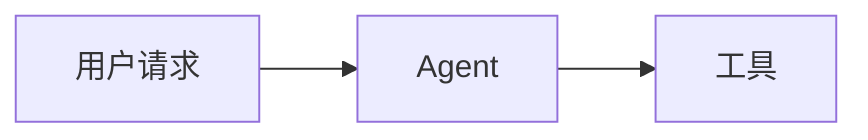

# Markdown 渲染

Agentdown 的渲染思路不是“把所有 token 都塞进一个大 HTML 字符串”，而是先把 markdown 压成更适合 Vue 组件消费的 block 列表。

## 渲染链路

1. `markdown-it` 负责原始解析。
2. `parseMarkdown()` 把 token 流压缩成 `MarkdownBlock[]`。
3. `MarkdownBlockList` 按 block 类型分发到对应组件。
4. `text` 优先走 pretext，复杂内容回退到 `html / code / mermaid / math / thought / agui / artifact / approval / attachment / branch / handoff / timeline`。

## 当前 block 类型

| 类型 | 来源 | 默认组件 | 说明 |
| --- | --- | --- | --- |
| `text` | 标题/段落与常见 inline 富文本 | `PretextTextBlock` | 优先使用 pretext 布局 |
| `html` | 复杂行内标记、表格、列表、引用、图片等 | `HtmlBlock` | 回退到增强型 HTML 渲染 |
| `code` | 普通 fenced code block | `CodeBlock` | 支持语言标签与复制 |
| `mermaid` | ` ```mermaid ` | `MermaidBlock` | 支持预览、全屏、拖拽与滚轮缩放 |
| `math` | 块级数学公式 | `MathBlock` | 使用 KaTeX |
| `thought` | `:::thought` | `ThoughtBlock` | 可折叠思考块 |
| `agui` | `:::vue-component` | `AguiComponentWrapper` | 注入运行态组件 |
| `artifact` | `:::artifact` | `ArtifactBlock` | 读取产物事件或静态 props |
| `approval` | `:::approval` | `ApprovalBlock` | 展示审批状态与结果 |
| `attachment` | `:::attachment` | `AttachmentBlock` | 展示用户文件、图片或结构化输入 |
| `branch` | `:::branch` | `BranchBlock` | 展示运行分支关系 |
| `handoff` | `:::handoff` | `HandoffBlock` | 展示交接给人工、团队或其他 Agent |
| `timeline` | `:::timeline` | `TimelineBlock` | 展示节点或全局事件时间线 |

## 哪些内容会优先走 pretext

当前标题、普通段落，以及包含粗体、斜体、删除线、链接、行内代码的常见 inline 富文本，都会继续走 pretext。  
一旦段落里出现图片、原生 inline HTML 等当前还不适合进入 pretext 主链的结构，Agentdown 才会把这个 block 回退成 `html`。

这意味着：

- 常见文本型富内容也可以保持在 pretext 主链
- 复杂结构化 block 更适合 HTML fallback
- 两条路径可以同时存在，而不是非此即彼

## AGUI 指令

### JSON 形式

```md
:::vue-component DemoRunBoard {"ref":"run:pricing","compact":true}
```

### Key-Value 形式

```md
:::vue-component DemoApprovalCard ref="approval:1" status="pending"
```

### 解析结果

`:::vue-component` 最终会产出 `kind: 'agui'` 的 block，并交给 `AguiComponentWrapper` 去：

- 根据组件名查找注册表
- 读取 `ref`
- 绑定 runtime
- 通过 provide/inject 向内部组件暴露 hooks 所需上下文

## Agent-native 内建指令

除了 `:::vue-component`，Agentdown 现在还内置了六种更接近协议层的 block：

### `:::artifact`

```md
:::artifact ref="tool:pricing" title="报价产物"
:::artifact title="报价单" artifactKind="report" href="https://example.com/report"
```

### `:::approval`

```md
:::approval ref="approval:finance" title="财务审批"
:::approval title="人工确认" status="pending" message="等待负责人确认"
```

### `:::attachment`

```md
:::attachment title="用户上传文件" attachment-id="file:brief" kind="file" label="brief.pdf"
:::attachment title="现场照片" kind="image" preview-src="https://example.com/photo.jpg"
```

### `:::branch`

```md
:::branch title="修订分支" branch-id="branch:revision-2" source-run-id="run:main" target-run-id="run:revision-2"
```

### `:::handoff`

```md
:::handoff title="交接人工审核" handoff-id="handoff:review" target-type="human" assignee="审核同学"
:::handoff title="转交给团队" target-type="team" assignee="法务团队" status="pending"
```

### `:::timeline`

```md
:::timeline ref="run:pricing" title="运行时间线" limit=8
:::timeline title="全局事件流" limit=12
```

这几类 block 的设计目标是：让 `artifact / approval / attachment / branch / handoff / timeline` 从“只有事件 helper”升级成“可以直接写进 markdown 的默认协议块”。

## 复杂 HTML 内容增强

默认 `HtmlBlock` 做了几件比较实用的增强：

- 宽表格自动包裹横向滚动容器
- 表头很多、行很多时仍能保持可读
- 外链默认新窗口打开
- 图片可点击预览
- 表格单元格里的链接和图片仍然可用

这也是为什么 Agentdown 的默认样式会尽量克制：增强交互应该存在，但不应该把用户自己的视觉系统锁死。

## 安全说明

`MarkdownRenderer` 默认是：

```ts
// 默认不直接放开不受信任的原生 HTML。
allowUnsafeHtml: false
```

也就是说，原生 HTML 的处理默认会尽量保持在安全边界内，而不是把不受信任的 HTML 直接全量注入到页面里。

如果你的内容源是完全受信任的，并且你明确需要放开这条能力，才建议显式开启：

```vue
<MarkdownRenderer
  :source="source"
  // 只有在内容完全可信时，才建议显式打开。
  :allow-unsafe-html="true"
/>
```

如果内容来自：

- 用户输入
- 外部模型输出
- 第三方系统回传

更推荐继续保持默认值，再用 block / renderer / Vue 组件的方式承载交互能力。

## Mermaid 与 Math

### Mermaid

````md

````

特点：

- 默认直接渲染图表
- 点击可全屏
- 全屏支持拖拽、滚轮缩放、重置缩放

### KaTeX

```md
$$
f(x) = \int_{-\infty}^{+\infty} \hat f(\xi)e^{2\pi i \xi x}\,d\xi
$$
```

## 自定义 markdown-it 插件

你可以通过 `plugins` 把额外的 `markdown-it` 插件注入进去：

```ts
import anchor from 'markdown-it-anchor';

// 通过 plugins 把额外 markdown-it 插件接进解析链路。
<MarkdownRenderer
  :source="source"
  :plugins="[anchor]"
/>
```

## 什么时候应该覆写内置组件

- 你的产品已经有完整的 code block / card / table / modal 设计系统
- 你想接入自己的动画、埋点、图标体系
- 你需要更强的 AGUI 展示能力，比如 timeline、artifact panel、approval panel

下一页建议继续看 [组件覆写](/guide/component-overrides)。
