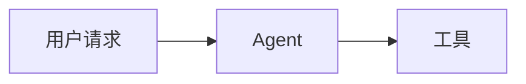

# Markdown 渲染

Agentdown 的渲染思路不是“把所有 token 都塞进一个大 HTML 字符串”，而是先把 markdown 压成更适合 Vue 组件消费的 block 列表。

## 渲染链路

1. `markdown-it` 负责原始解析。
2. `parseMarkdown()` 把 token 流压缩成 `MarkdownBlock[]`。
3. `MarkdownBlockList` 按 block 类型分发到对应组件。
4. `text` 优先走 pretext，复杂内容回退到 `html / code / mermaid / math / thought / agui`。

## 当前 block 类型

| 类型 | 来源 | 默认组件 | 说明 |
| --- | --- | --- | --- |
| `text` | 纯文本标题/段落 | `PretextTextBlock` | 优先使用 pretext 布局 |
| `html` | 复杂行内标记、表格、列表、引用、图片等 | `HtmlBlock` | 回退到增强型 HTML 渲染 |
| `code` | 普通 fenced code block | `CodeBlock` | 支持语言标签与复制 |
| `mermaid` | ` ```mermaid ` | `MermaidBlock` | 支持预览、全屏、拖拽与滚轮缩放 |
| `math` | 块级数学公式 | `MathBlock` | 使用 KaTeX |
| `thought` | `:::thought` | `ThoughtBlock` | 可折叠思考块 |
| `agui` | `:::vue-component` | `AguiComponentWrapper` | 注入运行态组件 |

## 哪些内容会优先走 pretext

当前只有“纯文本标题和段落”会走 pretext。  
一旦段落里出现复杂 inline 结构，例如链接、图片、强调、内联 HTML，Agentdown 会把这个 block 回退成 `html`。

这意味着：

- 纯文本流式输出更适合 pretext
- 富文本 block 更适合 HTML fallback
- 两条路径可以同时存在，而不是非此即彼

## AGUI 指令

### JSON 形式

```md
:::vue-component DemoRunBoard {"ref":"run:pricing","compact":true}
```

### Key-Value 形式

```md
:::vue-component DemoApprovalCard ref="approval:1" status="pending"
```

### 解析结果

`:::vue-component` 最终会产出 `kind: 'agui'` 的 block，并交给 `AguiComponentWrapper` 去：

- 根据组件名查找注册表
- 读取 `ref`
- 绑定 runtime
- 通过 provide/inject 向内部组件暴露 hooks 所需上下文

## 复杂 HTML 内容增强

默认 `HtmlBlock` 做了几件比较实用的增强：

- 宽表格自动包裹横向滚动容器
- 表头很多、行很多时仍能保持可读
- 外链默认新窗口打开
- 图片可点击预览
- 表格单元格里的链接和图片仍然可用

这也是为什么 Agentdown 的默认样式会尽量克制：增强交互应该存在，但不应该把用户自己的视觉系统锁死。

## Mermaid 与 Math

### Mermaid

````md

````

特点：

- 默认直接渲染图表
- 点击可全屏
- 全屏支持拖拽、滚轮缩放、重置缩放

### KaTeX

```md
$$
f(x) = \int_{-\infty}^{+\infty} \hat f(\xi)e^{2\pi i \xi x}\,d\xi
$$
```

## 自定义 markdown-it 插件

你可以通过 `plugins` 把额外的 `markdown-it` 插件注入进去：

```ts
import anchor from 'markdown-it-anchor';

<MarkdownRenderer
  :source="source"
  :plugins="[anchor]"
/>
```

## 什么时候应该覆写内置组件

- 你的产品已经有完整的 code block / card / table / modal 设计系统
- 你想接入自己的动画、埋点、图标体系
- 你需要更强的 AGUI 展示能力，比如 timeline、artifact panel、approval panel

下一页建议继续看 [组件覆写](/guide/component-overrides)。
