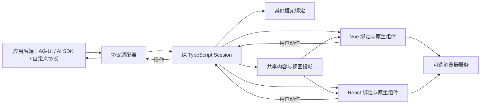

# Agentdown 下一代架构与 API 设计

日期：2026-10-10。状态：下一代设计提案，尚未实施。本文定义跨框架领域模型、公共 API、默认 UI 和验收标准；允许破坏性更新。

## 1. 产品方向

Agentdown 定位为**跨前端框架的 Agent 交互运行时与 UI**：把后端执行过程连接成用户可以完成的任务，包括发起请求、查看进度和工具、处理人工决策、继续执行、使用产物，以及断线后的恢复和历史回放。

首批 Vue 和 React 同时交付。新增前端框架只实现绑定与组件；新增后端协议只实现适配器。Angular、Svelte 等通过相同契约扩展，不复制 Session 逻辑。

产品的核心价值是整条流程的接入成本和可靠性。Markdown、Pretext、虚拟化、A2UI 都是实现这条流程的能力。已有竞品已经支持多个前端框架，因此多框架覆盖需要与真实流程体验一起验证。

Agentdown 管理前端状态、连接、操作协调、呈现与恢复接入。应用后端管理模型和工具执行、Agent 编排、用户授权、业务幂等及持久化；这两个边界在示例与文档中保持清楚。

## 2. 重新设计默认产品界面

默认 `AgentWorkspace` 围绕任务设计，支持紧凑聊天和工作台两种布局：

- 对话区域承载输入、解释、工具摘要与结果。
- 执行视图展示后端明确提供的步骤、工具、handoff 与当前进度；步骤事件有独立展示路径。
- 待处理区域集中展示审批、补充输入与表单，允许同一任务出现多个待处理交互。
- 产物区域展示文件、报告、结构化结果及版本；同一个产物更新保持同一身份。
- 状态提示分别表达执行情况、连接情况与操作确认结果，给出适用的继续、重连或重试操作。

这些区域都读取同一 Session。切换布局不重新发起任务。用户可以使用完整工作区，也可以用原有设计系统替换全部界面。

视觉系统重做为独立 tokens：颜色、间距、字体、圆角、状态、密度、明暗主题。框架实现采用原生组件，统一交互行为与可访问性标准。首批提供中文和英文文案配置。

## 3. 架构与依赖方向



| 逻辑模块 | 职责 | 边界 |
|---|---|---|
| core | 领域模型、事件归并、Session Store、操作协调、恢复格式 | 无 Vue、React、组件实例和 DOM 运行依赖 |
| adapters | 原生事件转换、请求转换、连接与能力声明 | 不导入任何框架 UI；不推断后端未承诺的能力 |
| content | 流式解析、中立内容模型、稳定节点、内容投影 | 不持有 Vue Component、VNode 或 JSX |
| a2ui | 版本处理、Surface、数据绑定、Catalog 与 action 协调 | 协议引擎共享，控件实现分框架 |
| browser | 测量、窗口计算、重型块调度及安全策略支持 | 可选；SSR 路径不依赖 Canvas、window 或 document |
| vue / react | 框架订阅、上下文、生命周期、默认与可组合 UI | 不各自实现审批、恢复、重试等业务状态机 |

建议使用轻量 workspace。逻辑模块可以比 npm 发布单位多；首批发布 core、Vue、React，重型内容及协议扩展按实际依赖成本拆包。把 Mermaid 放在子入口仍会安装依赖，真正按需安装需要独立包。

下文 `@agentdown/*` 是设计占位名称，未验证 npm scope 所有权，不是当前安装命令。已有 `agentdown` 包的最终归属在发布阶段确定。

## 4. 领域模型和身份

一个 Session 管理一个 `conversationId`。会话列表、路由和会话选择由宿主或 Workspace 上层管理。

| 记录 | 含义 | 关键关联 |
|---|---|---|
| Turn | 一次用户输入及其上下文 | `turnId`、输入、父执行、执行列表 |
| Execution | 一次逻辑执行尝试；重新生成产生新尝试 | `executionId`、`turnId`、后端确认的整体结果、Run 列表 |
| Run | 一个后端执行单元，可有并行子 Agent 或续跑片段 | `runId`、`executionId`、父 Run、原生身份、状态 |
| Message | 用户或 Agent 的内容记录 | `messageId`、`executionId`、稳定内容 parts |
| Step / ToolCall | 执行步骤与工具调用 | 独立 id、所属执行、父节点、状态、输入/输出 |
| Interaction | 审批、补充输入、handoff 决策、表单等请求 | `interactionId`、所属执行、类型、schema、状态 |
| Artifact / Surface | 可更新产物或生成式 UI | 稳定 id、版本、所属执行、数据或资源引用 |
| Operation | 客户端发起的一次操作 | `operationId`、冻结 payload、目标、投递及确认状态 |

重新生成创建新的 Execution，保留原来的 Turn 和旧结果。新的用户输入创建新 Turn，并明确引用其使用的父执行。一个 Execution 可以关联多个 Run；后端续跑换了原生 run 身份，也不会自动变成重新生成。多个执行及多个 Interaction 可以同时存在；适配器声明后端允许的并发数量，UI 按声明限制发起操作。

子 Run 完成不能直接推断整个 Execution 完成；整体终态来自后端的明确聚合或根执行终态。部分 Run 等待人工决定、其他 Run 仍在运行时，分别保留这些事实。界面上选择展示哪层进度不改变领域身份。

页面中选择哪个执行、展开哪个工具、输入草稿、滚动与焦点属于 UI 状态。后端共享的业务状态独立保存，修改通过支持的操作回传。记录中的业务完成或批准结果由后端事实确认。

## 5. 状态契约

三类状态分别建模，不能用一个 `busy` 替代：

1. **执行状态**：`pending / running / waiting / completed / failed / cancelled`。`waiting` 可以携带多个待处理交互。取消请求本身不直接把执行改成 `cancelled`。
2. **连接状态**：每个连接流分别记录 `idle / connecting / connected / reconnecting / disconnected / error`。流结束不等于任务完成。
3. **操作状态**：`queued / sending / delivered / uncertain / failed`，另记录后端接受状态 `unknown / accepted / rejected`。投递、后端接受和执行结果分别表达；HTTP 成功只表示适配器承诺的投递结果，业务是否完成继续看 Execution 或 Interaction。

审批中的本地选择和提交状态可以即时显示，但保留 `awaitingConfirmation`，直到后端确认或通过恢复查询得到确定结果。拒绝审批是一个业务选择；后端拒绝某次非法请求是操作错误，二者不混用。后端要求整批提交时，以一个含 items/schema 的 Interaction 表达原子提交单位，UI 收齐草稿后一次 respond；选择单项不提前创建 Operation。

UI 可以提供派生的 `canSend / canCancel / pendingInteractions` 等 selector。它们从真实状态和能力声明计算，不作为第二份可修改状态。

## 6. Core 公共 API

以下类型定义用于锁定语义；实现阶段补全各判别联合与错误类型。

```ts
interface AgentSession {
  readonly conversationId: string;
  getSnapshot(): SessionSnapshot;
  subscribe(listener: () => void): () => void;
  dispatch(action: AgentAction): OperationHandle;
  exportSnapshot(): SessionArchive;
  dispose(): void;
}

interface OperationHandle {
  readonly operationId: string;
  readonly attemptId: string;
  readonly delivery: Promise<DeliveryOutcome>;
}

type AgentAction =
  | { type: 'send'; input: UserInput; parentExecutionId?: string }
  | { type: 'respond'; interactionId: string; response: InteractionResponse }
  | { type: 'regenerate'; turnId: string; fromExecutionId?: string }
  | { type: 'cancelExecution'; executionId: string }
  | { type: 'disconnect'; executionId?: string }
  | { type: 'resume'; executionId: string }
  | { type: 'retryOperation'; operationId: string }
  | { type: 'surfaceAction'; surfaceId: string; action: SurfaceAction }
  | { type: 'updateAgentState'; update: AgentStateUpdate };

type DeliveryOutcome =
  | { status: 'delivered'; confirmation: 'transport' | 'backend'; remoteId?: string }
  | { status: 'uncertain'; reason: string }
  | { status: 'failed'; error: ActionError; retryable: boolean };
```

`dispatch` 是唯一业务写入口，马上产生可追踪的操作身份。bindings 的 `actions.send/respond/cancel/...` 只是 typed action 的薄封装。校验失败产生结构化失败结果；它不会启动网络请求。

`delivery` 只回答这次投递尝试的结果，不等待整个 Agent 任务。重投保留 operationId，创建新的 attemptId 和 delivery Promise。后续业务完成、确认与错误在快照中可追踪；投递不确定时不能向用户显示已批准或已取消。Promise 已完成后到达的后端确认仍可更新快照。

`getSnapshot()` 在 revision 不变时返回相同引用；未更新记录也保留引用。一个事件事务先完整归并，再通知订阅者。显示刷新可以合帧，事件处理与恢复游标提交不能丢事件。

ActionError 使用稳定 code，包括 `unsupported / invalidInput / conflict / expired / disposed / transport`。UI 可以按 code 提供文案；诊断不包含凭据。一次 Operation 的校验、投递和确认在同一记录中关联。

创建、订阅、反订阅及 Workspace 挂载均不自动发网络请求。`send / resume` 等明确动作才启动相关连接。`dispose` 幂等地结束客户端资源，后端取消通过 `cancelExecution` 单独发起。

预期的校验与投递错误通过 failed handle 表达，delivery 使用 fulfilled Result，不要求调用者依靠 try/catch。dispose 时，尚未发出的尝试以 `disposed` 失败结束；已发出且无法确定结果的尝试以 `uncertain` 结束，不能留下永不结算的 delivery 等待。

```ts
import { createAgentSession } from '@agentdown/core';
import { createAgUiAdapter } from '@agentdown/ag-ui';

const session = createAgentSession({
  conversationId: 'research-001',
  adapter: createAgUiAdapter({ endpoint: '/api/agent' })
});

const operation = session.dispatch({
  type: 'send',
  input: { text: '调研这个项目，先给计划，关键操作前让我确认。' }
});
const delivery = await operation.delivery;
// delivery 只描述投递；执行进度通过 session 的快照订阅获取。
```

Attachments 在核心中是可序列化资源引用。上传服务由应用提供；File、Blob、token 和请求 headers 不进入存档。

## 7. 协议与 Transport 扩展

适配器统一暴露三个职责：能力声明、操作提交、事件订阅。内部可以组合 SSE、JSON 请求、WebSocket 或 SDK；上层 UI 不受传输机制影响。

```ts
interface AgentAdapter {
  readonly id: string;
  readonly version: string;
  capabilities(context: SessionContext): AgentCapabilities;
  execute(operation: AdapterOperation, context: AdapterContext): Promise<AdapterReceipt>;
  events(subscription: EventSubscription, context: AdapterContext): AsyncIterable<EventEnvelope>;
}

interface EventEnvelope {
  streamId: string;
  eventId?: string;
  cursor?: string;
  executionId: string;
  event: DomainEvent;
}
```

订阅配置中的身份和游标必须属于对应流，不能拿一个全局 lastEventId 恢复所有并行执行。支持可靠补发的适配器需要稳定事件身份、明确的排序和游标语义；缺少这些条件时声明有限恢复能力。

`AdapterReceipt` 在请求握手或明确失败时返回，包含身份映射与事件订阅描述。SSE 的提交和事件读取可以共享同一个响应流；`execute` 和 `events` 不能各发一次任务请求。交接期间缓冲事件，不等待生成结束才返回 receipt。JSON 提交加独立订阅同样遵守一操作、一事件来源的规则。本地 executionId 在发送前分配，远端 run 身份到达后建立关联。

能力至少区分：历史读取、进行中恢复、服务端取消、人工决策类型、共享状态更新、Catalog 公布、A2UI 版本及 actions、操作幂等与结果查询、并发执行上限。未知能力视为不可用。端到端能力由后端契约与适配器共同决定。

`send` 是聊天适配器的基础能力；未协商时保守地允许一个新执行，其他可选行为保持关闭。静态接入配置和后端握手结果可以更新能力声明，不能为展示按钮自行假定取消、恢复或审批可用。

AG-UI 作为首条标准接入路径；自定义适配接口也在首批交付。AI SDK UIMessage stream 作为下一条生态路径。Agno、LangChain、AutoGen、CrewAI 等适配器逐个对照官方事件 fixture 验证后恢复，避免把“包已存在”当作全部交互能力已验证。

不会自动猜测一个任意 endpoint 的协议。最短示例显式选择适配器。A2UI 是呈现协议，AG-UI 是运行交互协议，两者分别接入并组合，不绑成唯一工作模式。

## 8. 幂等、恢复和回放

必须锁定以下规则：

- 同一 Operation 的重投沿用相同 id 和冻结 payload。更改决定或重新生成创建新 Operation；重新生成也创建新 Execution。
- `retryOperation` 是客户端协调动作，指向原 Operation，不作为新的后端业务操作发送；已经得到后端最终接受或拒绝确认的操作不能再次重投。
- 同一 Interaction 的重复点击复用正在处理的 Operation。未确定的决定不能被另一决定静默覆盖；更改需后端允许并按 Interaction revision 做条件校验。
- delivery 不确定时，仅在后端支持操作幂等或结果查询时允许安全自动重投；否则呈现不确定状态，并让应用选择核实方式。
- 同一稳定事件重复到达，只归并一次。顺序缺口按该适配器的排序契约处理，不把后到的旧状态覆盖新状态。
- 旧连接、旧会话和已销毁实例的异步结果通过身份及 connection epoch 隔离。
- 事件通过校验并完成归并后才推进游标。持久化时，状态、去重信息和对应游标属于同一个存档版本；写入失败不能报告已保存。
- 恢复沿用 live 事件的归并逻辑，但恢复记录不会重发业务操作。待确认操作先恢复事实，再决定是否需要重投。
- 导入历史是被动回放；继续后端任务必须显式 `resume`，并核验后端仍保留执行与权限。

`streamId` 标识可恢复的逻辑事件流，重连沿用；connection epoch 标识物理连接。适配器声明 eventId 的唯一性作用域、cursor 是否包含当前事件及补发窗口。去重信息只能按可证明的 checkpoint / replay horizon 淘汰；不能任意裁掉旧 id 后仍承诺完整去重。

```ts
const restored = createAgentSession({
  conversationId: archive.conversationId,
  adapter,
  initialSnapshot: archive,
  mode: 'replay' // 不接网、不回传审批或 Surface actions
});

const live = createAgentSession({
  conversationId: archive.conversationId,
  adapter,
  initialSnapshot: archive,
  mode: 'live' // 创建仍然被动，下一条动作才开始恢复
});
live.dispatch({ type: 'resume', executionId: activeExecutionId });
```

存档至少含 `schemaVersion`、会话/执行身份、领域记录、去重与游标、未确定操作的身份及 payload、适配器与内容格式版本。凭据、组件对象、DOM 和纯页面状态排除在外。业务数据本身可能敏感，保存位置和脱敏由应用配置。

旧存档通过独立转换器导入；不能可靠映射的字段和进行中任务返回明确诊断。新 API 不承诺旧格式可以直接继续执行。客户端回放可用，也不表示后端任务仍可续跑。

## 9. Vue 与 React 使用 API

两种绑定使用相同的业务概念和操作名，分别输出 Vue 的只读 refs 与 React 的当前 render snapshot。

`session.getSnapshot()` 返回按 id 组织的领域 `SessionSnapshot`。binding 返回的 `snapshot` 是共享纯投影产生的 `AgentViewSnapshot`，提供有序 messages、待处理项和 `canSend` 等便利字段；它只读、按 revision 缓存，不形成第二份可修改状态。高级 selector 可以直接读取领域快照。

`useAgentSession(existingSession)` 借用已有 Session，卸载时只退订。`useAgentSession(options)` 创建 owned Session，创建仍无副作用，所属 scope 最终卸载时释放客户端资源。共享 Session 的所有者放在稳定上层；子组件只借用。配置身份改变时隔离旧会话，普通重新 render 不重建任务。

Owned binding 内部协调生命周期租约：React StrictMode 的临时 cleanup/remount 不能永久 dispose 随后还会复用的实例。最终释放可通过可撤销的延后任务协调；未 commit 的纯本地实例无外部资源，允许回收。这些机制属于绑定内部，不加入 core 公共 API，也不触发自动连接。该行为需要专门的 StrictMode 与多消费者验证。

Vue：

```vue
<script setup lang="ts">
import { AgentWorkspace, useAgentSession } from '@agentdown/vue';
import { createAgUiAdapter } from '@agentdown/ag-ui';

const { session } = useAgentSession({
  conversationId: 'research-001',
  adapter: createAgUiAdapter({ endpoint: '/api/agent' })
});
</script>

<template>
  <AgentWorkspace :session="session" layout="workbench" />
</template>
```

React：

```tsx
import { AgentWorkspace, useAgentSession } from '@agentdown/react';
import { createAgUiAdapter } from '@agentdown/ag-ui';

const adapter = createAgUiAdapter({ endpoint: '/api/agent' });

export function ResearchWorkspace() {
  const { session } = useAgentSession({
    conversationId: 'research-001', adapter
  });
  return <AgentWorkspace session={session} layout="workbench" />;
}
```

上面的 adapter 是无凭据的静态配置示例。SSR 中涉及用户状态、headers 或 cookies 的实例按请求创建；Session 也必须按请求创建。

进一步定制：

```tsx
<AgentProvider session={session}>
  <main className="my-workspace">
    <AgentConversation />
    <AgentExecutionPanel />
    <AgentInteractionQueue />
    <AgentArtifactPanel />
    <AgentComposer />
  </main>
</AgentProvider>
```

Vue 提供同名组件和 slots，React 提供 typed render callbacks / component slots。自建 UI 使用 `useAgentSelector` 和 `actions`，不需要默认样式或组件。比如审批调用 `actions.respond(interactionId, { kind: 'approval', decision: 'approve' })`；允许的选项、时效及 payload 按该 Interaction 的 schema 验证。

## 10. 组件声明、内容与 A2UI

共享 Catalog 是纯 JSON：`rendererId / description / propsSchema / actions / layoutHints`。Vue 与 React 各自注册组件实现。Agent 只接触可信声明；输出是 rendererId 和校验过的 JSON props。

```ts
// 共享模块
export const catalog = {
  weather: {
    description: '展示已取得的天气数据',
    propsSchema: weatherSchema,
    actions: [],
    layoutHints: { minHeight: 120 }
  }
};

// Vue 或 React 的本地 UI 配置
const renderers = { weather: WeatherCard };
```

core 接收 Catalog，Workspace/Provider 接收本地 renderers。声明与实现分开校验。Catalog 如何公布给 Agent 必须由适配器及后端明确支持；AG-UI 本身不自动代表后端认识所有组件元数据。

旧 `:::vue-component` 改成中立 descriptor。规范的 wire representation 优先使用结构化 content part；Markdown 中需要扩展语法时使用统一 `agent-component` 名称，由同一解析器识别。

Markdown 通过“流式文本 → 中立内容模型 → 框架 renderer”处理。中立模型覆盖段落、inline marks、列表、表格、代码、公式、图和受控组件。原始文本是可恢复事实；派生解析结果按内容 revision 缓存，节点身份在流式更新中保持稳定。

Pretext 只作为可选测量策略。大内容优化共享窗口算法和预算，各框架管理 refs、observer、焦点与挂载。SSR 先输出确定性安全结构，hydration 后增强。支持内容修订事件时，仅按显式 revision 更新，不把旧 delta 当追加文本。

A2UI 复用官方协议引擎，通过版本协商和相同 fixtures 验证。共享 Surface、数据和 action 语义，各框架提供原生控件 Catalog。首批共同控件覆盖布局、文本、按钮、输入、选择和表单；支持清单必须明确。

本地编辑草稿与协议数据分开。协议更新按选定版本生效；若覆盖正在编辑的字段，保留草稿并明确提示冲突，提交时根据最新 revision 校验。框架不能因为普通更新重挂整棵表单，导致焦点、光标或 IME 输入丢失。

HTML、URL、外部资源及未知组件执行同一安全政策。原始 HTML 默认关闭；开启需提供明确 sanitizer。服务端没有 sanitizer 时 fail closed。资源数量、深度、文本长度及重型任务预算有可配置上限。

## 11. 技术选择

| 方面 | 本轮建议 | 实施时必须验证 |
|---|---|---|
| 核心状态 | 严格 TypeScript、纯事件归并与 Session coordinator、稳定外部 Store | Node 无 DOM运行、引用稳定、重放一致、边界无框架类型 |
| 框架 | Vue 3、React；分别采用原生绑定和组件 | React 外部 Store/StrictMode，Vue effect scope；共同业务契约 |
| Markdown | 先用接口隔离 markdown-it；以中立模型和流式 fixtures 评估 unified/remark 等候选 | 不完整语法、稳定节点、增量成本和内容插件能力 |
| A2UI | 官方 web_core；版本协商，协议与控件实现拆开 | 当前 0.13.0 子入口的依赖成本；不能把 v0.9 数据直接当 v1.0 |
| 浏览器优化 | 按需测量、窗口化和重型块调度；Pretext 可选 | SSR/hydration、滚动、选择、取消和资源清理 |
| 构建 | 轻量 workspace，Vue/React 用 Vite，纯 TS 包独立构建 | 包 exports 与声明、真正独立安装、构建 Node 要求与库运行要求分开 |
| 验证 | Vitest、Playwright、双框架共同 fixture、tarball consumer | 功能契约、SSR、性能预算与真实发布包 |

允许完全换实现，不要求复用旧代码。成熟协议、解析器和正确性 fixtures 按证据保留；依赖版本与工具更新必须服务于新的边界与验收。

## 12. 重写阶段和可交付结果

### 阶段一：核心与双框架纵向流程

先设置契约原型门槛：交付最小无模型参考后端与 Vue/React 薄 UI，验证 POST SSE 交接、StrictMode、断线补发、投递不确定后的查询/幂等重投、刷新恢复和 SSR hydration。参考后端明确实现所演示的能力，录制 fixture 负责回放和归并验证。门槛通过后再展开默认工作区与完整视觉系统。

实现 core、AG-UI 与自定义适配接口、Vue/React bindings 和默认 UI，共享内容模型。交付同一后端的 Vue 和 React starter，完成“发送 → 文本/步骤 → 工具 → 多个审批 → 继续 → 产物 → 断线/刷新恢复”。本地录制 fixture 保证无需模型密钥也能运行与验证。

### 阶段二：内容与生成式 UI 完整体验

补齐 A2UI 版本与基础控件、共享状态、表单草稿冲突、附件和文件预览、代码/公式/图等内容扩展、长列表、SSR/hydration、主题、locale 与可访问性。两种框架以相同场景验收。

### 阶段三：适配器、迁移与发布

逐个验证 AI SDK 及现有 Agent 框架接入；提供旧 API/存档迁移指南、性能结果与独立安装示例。修复并验证 npm 发布链路，先发 next 预览，再发正式版本。Angular/Svelte 绑定在首批契约稳定后增加。

阶段一是可运行的完整代表流程，不能标成全部旧能力已重写。正式版本在承诺的能力矩阵、双框架验收和真实包安装均通过后发布。

## 13. 验收标准

| 验收项 | 必须看到的结果 |
|---|---|
| 同一事件 trace | Vue/React 的领域记录、操作回传与最终结果一致 |
| 多个交互 | 并行待审批不覆盖，批准/拒绝/编辑对应正确身份 |
| 操作中断 | 投递不确定与后端确认区分；支持幂等时沿原 id 重试 |
| 连接中断和刷新 | 重复事件不重复追加，游标归属正确，旧连接不污染状态 |
| 取消与断开 | 前端退订不自动取消；服务端确认后才展示已取消 |
| 回放 | 导入和回放无网络、无工具执行、无审批/表单副作用 |
| 内容流 | 半截 fence/table/link/公式不破坏 UI；已完成节点保持身份 |
| A2UI | 同一表单的更新、校验、提交、Surface 生命周期及错误语义一致 |
| 生命周期 | StrictMode、重复挂载/卸载、多消费者时无重复请求或资源泄漏 |
| SSR | 按请求隔离，无 DOM 和网络副作用，hydration 无 mismatch |
| 包边界 | core 不带 Vue/React/DOM；React 最小安装不需要 Vue，反之亦然 |
| 性能 | 同机同 trace 报告首屏、帧间隔、长任务、DOM、内存、滚动漂移、恢复耗时和包大小 |
| 发布 | 文档、exports、类型、dist-tag 与 tarball 同版本，独立 consumer 验证通过 |

性能目标在第一条可运行纵向流程上测出基线后定预算，再以相同机器和内容检测回归；本轮不编造性能提升数字。

## 14. 设计依据与待实施验证

源码已确认的重写原因：会话工厂依赖 Vue；公共内容类型混入 Vue Component；A2UI Catalog 混合协议和 Vue 控件；统一 hook 最终转交不同会话实现；runtime 快照每次新建对象；步骤已入状态但缺少稳定 UI 展示路径。详细证据与竞品/npm 调研见 [发展调研](research.md)。

架构和 API 的以上规则是本轮建议。实现前后需要用小型验证锁定 Markdown 解析选择、A2UI 版本及实际依赖图、构建器和包名。它们不改变核心与两条扩展轴，也不作为继续架构设计的阻塞条件。

补充设计稿：[核心契约](core.md)、[双框架消费与组件契约](ui.md)。存在命名或细节差异时，以本文的统一契约为准。
